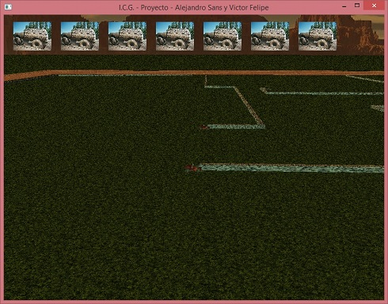

# CrazyJeep
This is a project created by Alejandro Sans (sansalejandro@gmail.com) and Víctor Felipe as a final project for a Computer Graphic course (Universidad Central de Venezuela). 

Crazy Jeep is a videogame where a player must face several computer enemies (just single player right now). The player and the enemies are Jeeps than when they move, they left behind a wall which the others can collide. The objective of the game is to move around avoiding others walls (and your too) and trying to make the others to collide. The player wins if all enemies collides with walls

# Compiling

This project requires compiling with visual studio 2015 and the following external libraries:
* [SDL] 2.0.5 
* [SDL_mixer] 2.0.1
* [FreeGLUT] 3.0.0-2
* [FreeImage] 3.17.0

To compile in visual studio, the header files of the external libraries must be on a "tools" folder that must be created on the folder "Proyecto/Proyecto". The Header should be included as follow:

    - Proyecto/Proyecto/tools/GL/ (freeglut headers)
    - Proyecto/Proyecto/tools/SDL/ (SDL and SDL_mixer)
    - Proyecto/Proyecto/tools/FreeImage (FreeImage)

The libraries must be on a folder "lib" that must be created on the folder "Proyecto" as follow:

    - Proyecto/lib

And the .dll should be include on the compilation folder, in "Proyecto/Proyecto"

# License
Crazy Jeep uses the tracks "Bus" by NINES (091999) and "Mastodon Bus" by John Bura. The song are available under a Creative Commons BY-ND-NC license (see http://creativecommons.org/licenses/by-nc-sa/3.0/) in http://www.jamendo.com/

Crazy Jeep is free software.

# Images

Here are some images of the videogame

And finally, a [video] of the game in the link

   [video]: <https://vimeo.com/37664294>
   [SDL]: <https://www.libsdl.org/>
   [SDL_mixer]: <https://www.libsdl.org/projects/SDL_mixer/>
   [FreeGLUT]: <http://freeglut.sourceforge.net/>
   [FreeImage]: <http://freeimage.sourceforge.net/>
